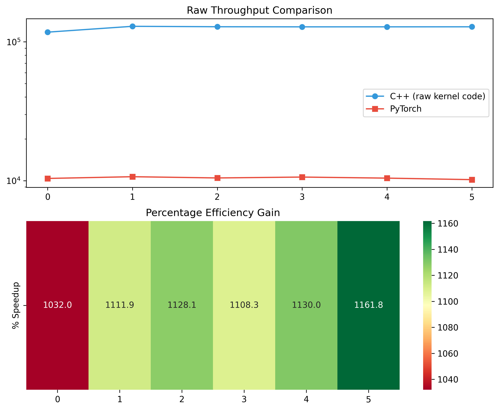

Learning how to code without Generative AI and learn how to do Mathmatical modeling step by step. This example is an implementation of a Feedforward Neural Network using Backpropagation and Gradient Descent. 

Dataset I used: MNIST numbers, csv and binary(idx)

Update status:

First got basic Neural Network with backprop working with 95% accuracy in 3000 iterations

Rewrote my Gradient Descent Function as a SGD so I can look at 1 small subset iteration when training. 

C++ rewrite
    
    /include
        data_loader.hpp - Load the MNIST dataset in C++(done)
        layer.hpp - weights and bias declared and also declaration of compuations done with GPU (in progress)

    /src
        data_loader.cpp - read csv data from data_loader and format to use for Neural Network. 
        layer.cu - raw computations done on GPU
        main.cu - all files get called here and executes. allocate and deallocate pointers and free memory after run ends
        

    CMakeLists.txt - compiler code to setup model in C++

Graphed data of Results:

Reflection:

C++ rewrite 3.51x faster than Python Version. C++ can process 132,131 images/sec, while Python ranges between 20,000-30,000 images/sec

I ran a second test. C++ model vs Pytorch model, C=+ model smoked it significantly. 
133k images/sec vs 10,000 images/sec

C++ written with only CUDA libary calls for cpu/gpu data transfer.

Future Considerations
- take advantage of unifed memory
- potentially use tiling with matrix multiplication to full extent.
- Use different variations of softmax beside from hardcoding output layer. 

    

