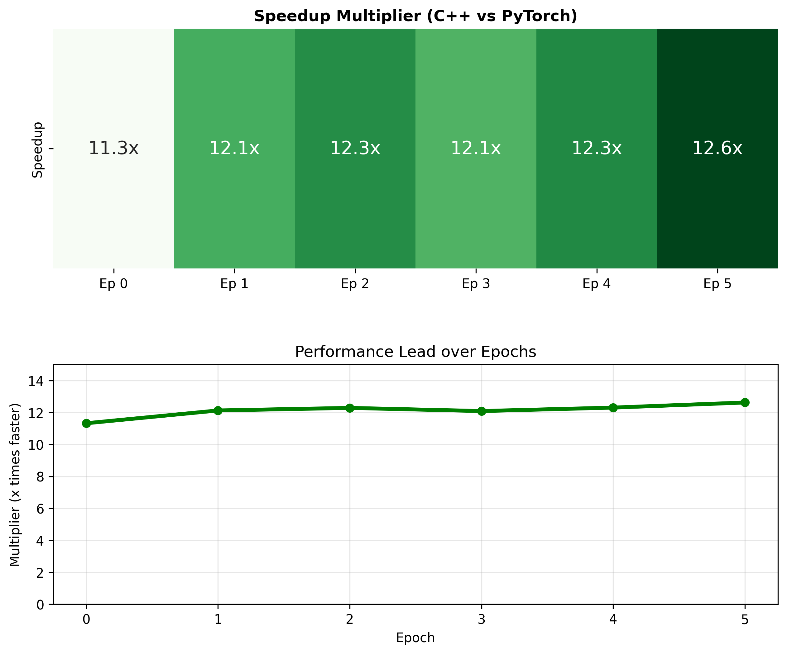

Learning how to code without Generative AI and learn how to do Mathmatical modeling step by step. This example is an implementation of a Feedforward Neural Network using Backpropagation and Gradient Descent. 

Dataset I used: MNIST numbers, csv and binary(idx)

Update status:

First got basic Neural Network with backprop working with 95% accuracy in 3000 iterations, iterations became tedious so I began training in epochs/batches to see how my model would react with more stability and faster training. 

Rewrote my Gradient Descent Function as a SGD so I can look at 1 small subset iteration when training. 

C++ rewrite
    
    /include
        data_loader.hpp - Load the MNIST dataset in C++(done)
        layer.hpp - weights and bias declared and also declaration of compuations done with GPU (in progress)

    /src
        data_loader.cpp - read csv data from data_loader and format to use for Neural Network. 
        layer.cu - raw computations done on GPU
        main.cu - all files get called here and executes. allocate and deallocate pointers and free memory after run ends
        

    CMakeLists.txt - compiler code to setup model in C++

Graphed data of Results:

I got my data from my C++ model and compared it to the Pytorch model. It seems all my performance optimizations really paid off when comparing to Pytorch. 

Graph 1 of Kernel Operation in raw %

Graph 2 Kernel Operation Multiplier values

Reflection:

C++ rewrite has 3.51x more throughput than Python Version with no Pytorch. C++ can process 132,131 images/sec, while Python ranges between 20,000-30,000 images/sec
C++ version smokes Pytorch in the graphs above(11-13x more throughput). I would like to say Torch is super convenient to use but for raw optimization, much more has to be done. 

Basically the throughput and speedup is signicantly faster in C++ in the Kernel computing

Full Runtime comparison: 
C++: 3307.51 ms
Pytorch 38682.8502999997 ms

11.7x speedup when accounting for cpu + gpu data transfers + all operations

C++ written with only CUDA libary calls for cpu/gpu data transfer.

Future Considerations
- look into deriving cudaMalloc and cudaMemcpy to get full control how neurons react in data transfer  
- take advantage of unifed memory(I only use 1 hardware device so maybe no point)
- potentially use tiling with matrix multiplication to full extent.
- Use different variations of softmax beside from hardcoding output layer. 
   

